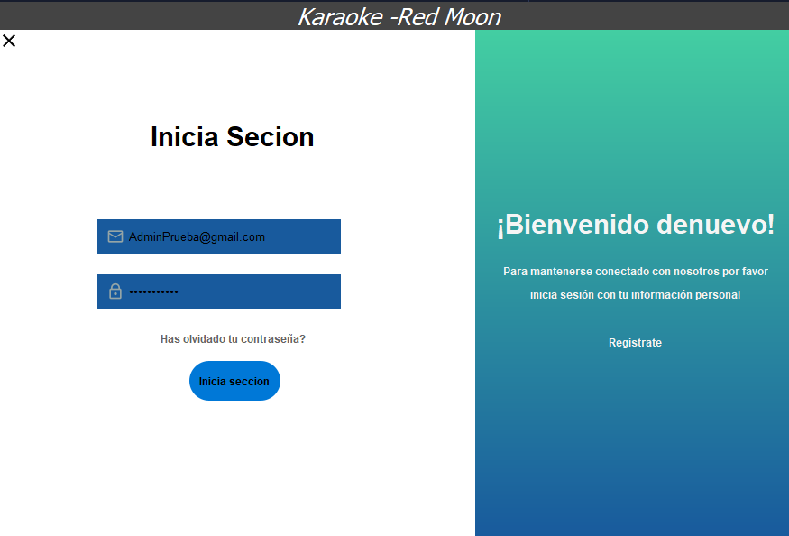
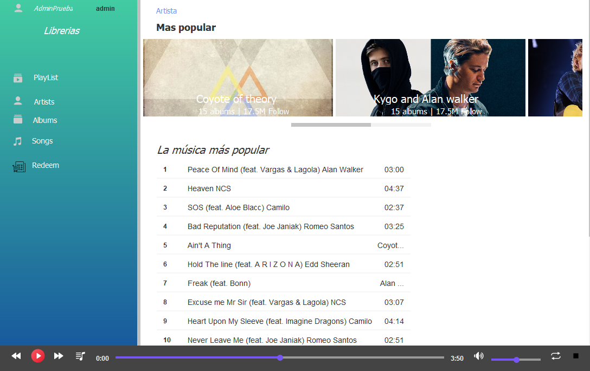
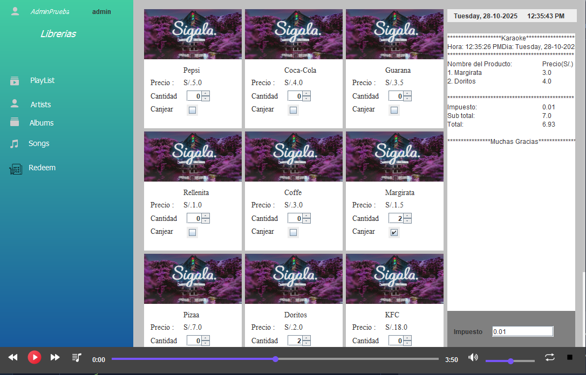
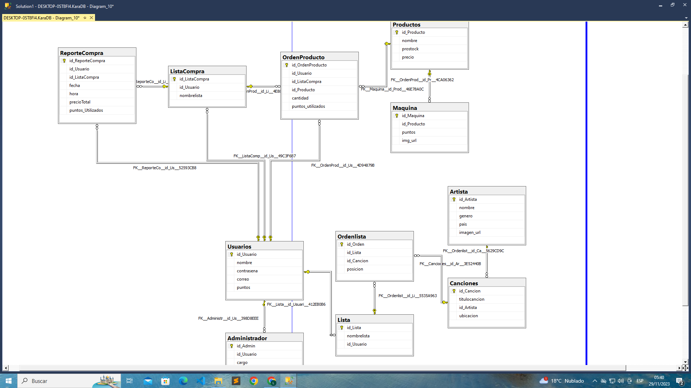

# 🎶 Karaoke Music Player – Java Desktop App

Desktop application developed in **Java (Swing)** as a first personal project to learn object-oriented programming, multimedia file management and databases. 

---

## 🧩 General Description

The system simulates a **karaoke-style music player**, with a login, rewards store, audio player, and panels for managing playlists, artists, albums, and songs.

It features an **SQLite** database for local storage of user and cached data.

### 🪄 Main features:
- Registration and **login with encrypted passwords**.
- **SQLite database connection** for data persistence.
- **Functional audio player** (MP3) using external libraries.
- **Redeem system** with automatic generation of **PDF tickets**.
- **Swing** based interface, with multiple panels:
  - 🎵 Songs
  - 🎧 Artists
  - 💽 Albums
  - 📃 Playlist
  - 🛒 Redeem (Functional store)
- Modular design with controllers, business logic, and a DAO.
- Initial attempt at integration with **Sphinx4** (speech-to-text, not fully implemented).
---

## ⚙️ Technologies and Libraries

| Tipo | Nombre / Versión | Descripción |
|------|------------------|-------------|
| Language | Java (JDK 8+) | Base language of the project |
| GUI | Swing | Graphical User Interface |
| BD | SQLite | Embedded Database |
| Audio | BasicPlayer | MP3 file playback |
| Audio | jl1.0 / mp3spi / tritonus_share / jogg | Support for various formats |
| Layout | MigLayout | Advanced layout management in Swing |
| Logging | Commons Logging API | Event logging |
| Timing | Timing Framework | Animations and synchronization |
| Speech recognition | Sphinx4 | (Planned, not finalized) |
| Reports | iText or native PDF generator | PDF ticket generation |
---

## 🧱 Project Structure
```
.
├── Librerias/                # External libraries (.jar) for audio, PDF, etc.
├── src/
│   ├── BDconexion/           # Connection and utilities for the SQLite database
│   ├── Cruds/                # CRUD forms developed in Swing
│   ├── GetaSet/              # Model classes (POJO) with getters and setters
│   ├── Metodos/              # Classes that implement business logic (CRUD)
│   ├── Musica/               # MP3 files used by the system
│   ├── Paneles/              # Complementary panels for the graphical interface
│   ├── Perzonalizado/        # Custom Visual Components (UI)
│   ├── Ventana/              # main windows (Main, Dashboard, etc.)
│   ├── Vista/                # General visual control (main menu, navigation,login)
│   ├── icon/                 # Program icons and images
│   │   ├── productos/
│   │   └── test/
│   ├── IMG/                  # Graphic resources (backgrounds, logos, buttons)
│   └── testeo/               # Testing and Debugging Classes (Sphinx4)
├── target/                   # Compiled files (excluded in .gitignore)
├── README.md                 # Project documentation
└── database.db               # Local SQLite database

```
---
## 🖼️ Screenshots

### 🔐 Login Screen


### 🎵 Main Dashboard


### 🛒 Redeem Store


### 🛒 Data Base

---
## 🧮 Example of generated report

```
.
********************Karaoke*******************
Hora: 2:33:03 PMDia: Monday, 27-10-2025
***********************************************
Nombre del Producto: Precio(S/.)
1. Coca-Cola 8.0
2. Margirata 1.5
***********************************************
Impuesto: 0.01
Sub total: 9.5
Total: 9.405
****************Muchas Gracias*****************
```

---

## 🚀 How to Run It

1. Clone the repository or download the ZIP file.
2. Open the project in IntelliJ IDEA or Eclipse.
3. Make sure you have the external libraries (lib/*.jar) included in your classpath.
4. Run the RLogin.java class to start the application.
5. Access with user AdminPrueba@gmail.com and password AdminPrueba.
---

## 💡 Improvements I would have liked to see implemented
- Integrate **speech-to-text** with Sphinx4.
- Allow **karaoke video playback**.
- Improve the interface with **JavaFX or a modern style**.
- Add online authentication or global user ranking.

---

## 👨‍💻 Author

**Lenin Laura García**  
📚 This was my first Java project to practice OOP, GUI design, and local data persistence.  
🧩 It helped me understand how to structure an application from scratch and integrate external libraries.  